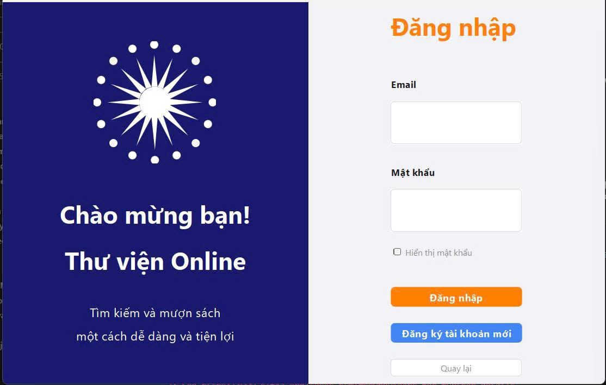
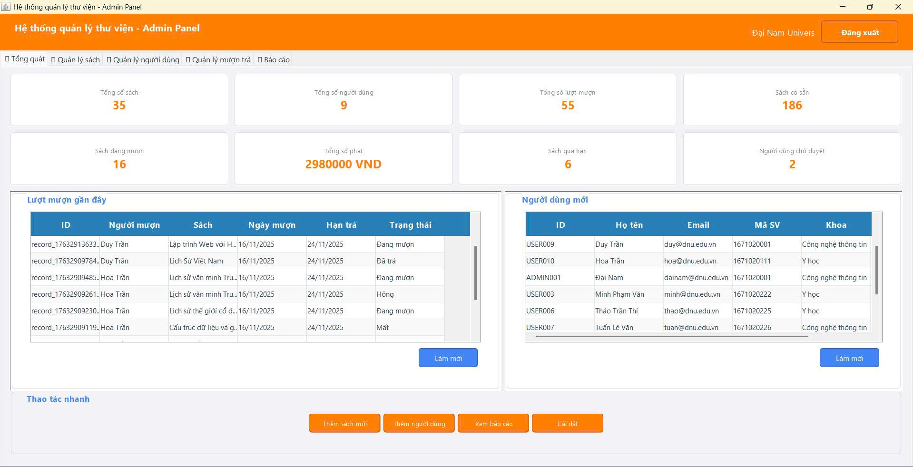
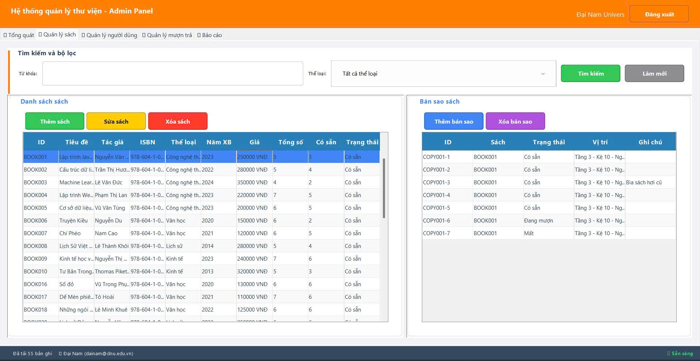
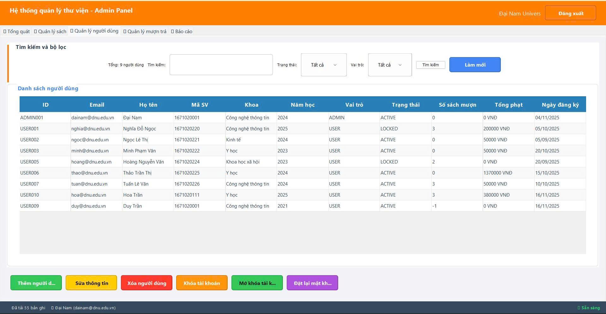
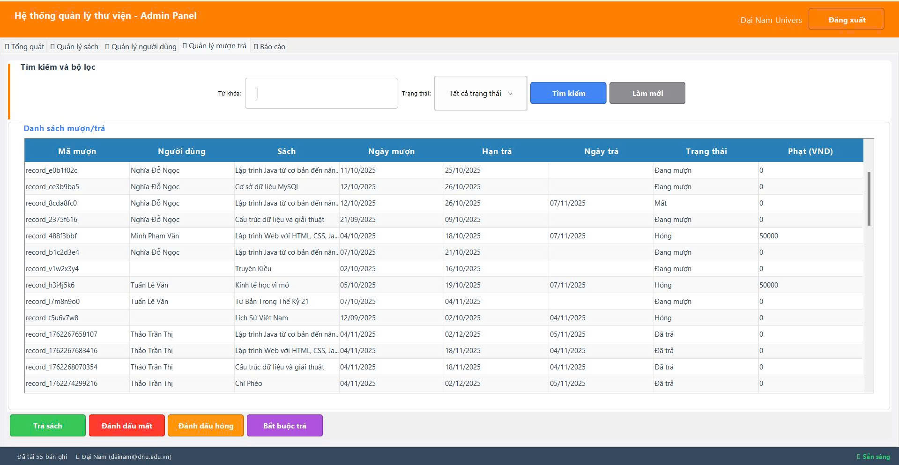
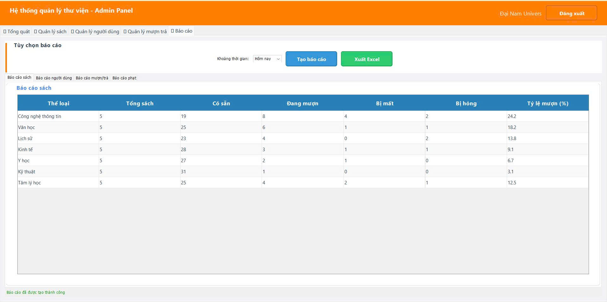
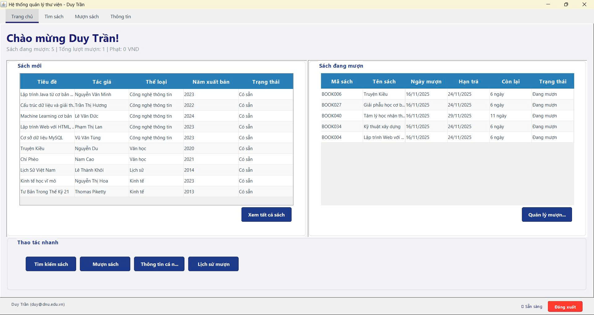
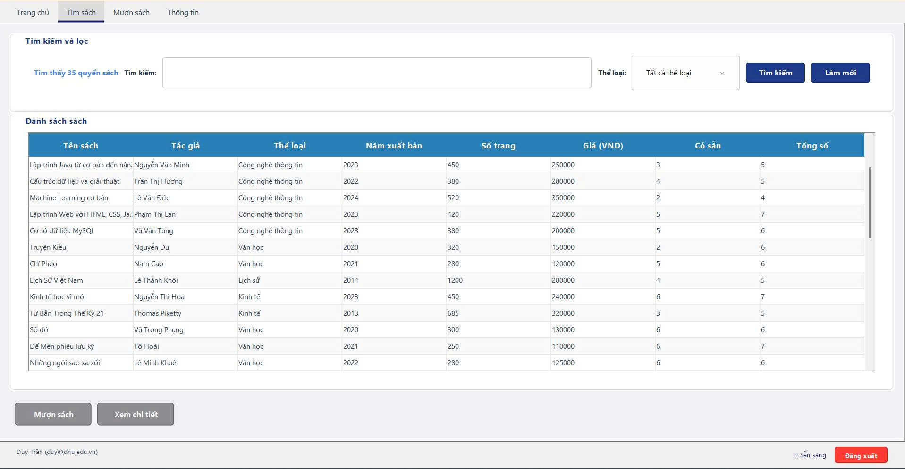
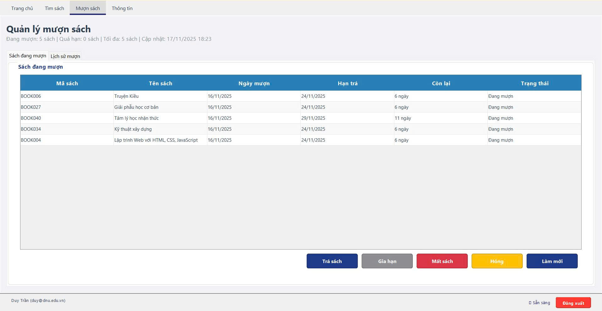
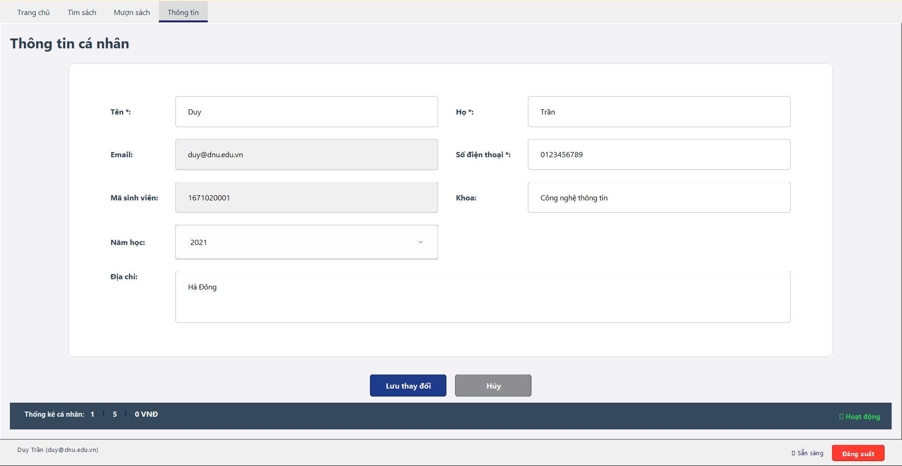

<h2 align="center">
    <a href="https://dainam.edu.vn/vi/khoa-cong-nghe-thong-tin">
    🎓 Faculty of Information Technology (DaiNam University)
    </a>
</h2>
<h2 align="center">
   QUẢN LÝ SÁCH - THƯ VIỆN QUA MẠNG
</h2>
<div align="center">
    <p align="center">
        
        
        
    </p>

[](https://www.facebook.com/DNUAIoTLab)
[](https://dainam.edu.vn/vi/khoa-cong-nghe-thong-tin)
[](https://dainam.edu.vn)

</div>

## 📖 1. Giới thiệu

Ứng dụng Quản lý sách – thư viện qua mạng được xây dựng trên mô hình Client – Server sử dụng:
- **TCP** (ServerSocket, Socket) để trao đổi dữ liệu qua mạng.
- **Java Swing** để xây dựng giao diện người dùng.
- **MongoDB** để lưu trữ dữ liệu.
- **Maven** để quản lý dependencies và build project.

📌 **Mục tiêu**

Tạo ra một hệ thống thư viện trực tuyến, trong đó Server quản lý dữ liệu (sách, người dùng, mượn/trả), còn Client cung cấp giao diện cho người dùng đăng nhập, tìm kiếm và mượn sách từ xa với phân quyền Admin và User.

### ✨ Các chức năng chính

#### Chức năng chung
- **Đăng nhập/Đăng ký** người dùng với phân quyền (Admin/User)
- **Tìm kiếm sách** theo tên, tác giả, thể loại
- **Xem danh sách sách** với đầy đủ thông tin

#### Chức năng Admin
- **Quản lý sách**: Thêm, Sửa, Xóa sách, Quản lý Book Copies
- **Quản lý người dùng**: Thêm, Sửa, Xóa người dùng, Khóa/Mở khóa tài khoản, Đặt lại mật khẩu
- **Quản lý mượn trả**: Xem tất cả bản ghi mượn trả, Đánh dấu mất/hỏng sách, Bắt buộc trả sách
- **Dashboard & Báo cáo**: Thống kê tổng quan, Báo cáo sách, Báo cáo người dùng, Báo cáo mượn trả, Báo cáo phạt

#### Chức năng User
- **Xem trang chủ** với thống kê cá nhân
- **Tìm kiếm và xem chi tiết sách**
- **Mượn sách** (giới hạn 5 sách/người)
- **Trả sách** với tính phạt tự động
- **Gia hạn sách**
- **Xem lịch sử mượn sách** của mình
- **Xem và sửa thông tin cá nhân**

## 🔧 2. Ngôn ngữ lập trình sử dụng

[](https://www.java.com/)
[](https://www.mongodb.com/)
[](https://maven.apache.org/)

- **Ngôn ngữ lập trình**: Java (JDK 11+)  
- **Giao diện**: Java Swing  
- **Mạng**: TCP Protocol (ServerSocket, Socket)  
- **Lưu trữ dữ liệu**: MongoDB (NoSQL Database)
- **Build Tool**: Maven
- **Môi trường phát triển**: Visual Studio Code (khuyến nghị), IntelliJ IDEA, Eclipse, hoặc NetBeans
- **Hệ điều hành**: Windows / macOS / Linux

## 🚀 3. Hình ảnh giao diện
### Giao diện đăng nhập
<p align="center">
  
</p>

### Tổng quát ( Admin )
<p align="center">
  
</p>

### Quản lý sách ( Admin )
<p align="center">
  
</p>

### Quản lý người dùng ( Admin )
<p align="center">
  
</p>

### Quản lý mượn trả ( Admin )
<p align="center">
  
</p>

### Báo cáo ( Admin )
<p align="center">
  
</p>

### Trang chủ ( User )
<p align="center">
  
</p>

### Tìm sách ( User )
<p align="center">
  
</p>

### Mượn trả ( User )
<p align="center">
  
</p>

### Thông tin ( User )
<p align="center">
  
</p>


## 📝 4. Hướng dẫn cài đặt và sử dụng

### 🔧 Yêu cầu hệ thống

- **Java Development Kit (JDK)**: Phiên bản 11 trở lên  
- **Maven**: Phiên bản 3.6+ (hoặc sử dụng Maven wrapper có sẵn)
- **MongoDB Server**: Đang chạy trên `localhost:27017`
- **MongoDB Compass**: Khuyến nghị để xem dữ liệu (tùy chọn)
- **Hệ điều hành**: Windows / macOS / Linux
- **IDE khuyến nghị**: Visual Studio Code (với Extension Pack for Java), IntelliJ IDEA, Eclipse, hoặc NetBeans
- **Bộ nhớ**: Tối thiểu 512MB RAM  

---

### 📦 Các bước triển khai

#### 🔹 Bước 1: Chuẩn bị môi trường

1. **Cài đặt các công cụ cần thiết:**
   - **JDK 11+**: Tải tại [Oracle JDK](https://www.oracle.com/java/technologies/javase-downloads.html) hoặc [OpenJDK](https://adoptium.net/)
   - **MongoDB**: Tải tại [MongoDB Download Center](https://www.mongodb.com/try/download/community) và khởi động trên port 27017
   - **Maven 3.6+**: Tải tại [Apache Maven](https://maven.apache.org/download.cgi)
   - **VS Code**: Tải tại [Visual Studio Code](https://code.visualstudio.com/) và cài đặt **Extension Pack for Java**

2. **Clone và mở project:**
   ```bash
   git clone https://github.com/trantriduy0511/Quan-ly-sach-thu-vien-qua-mang.git
   cd Quan-ly-sach-thu-vien-qua-mang
   ```
   Mở thư mục project trong VS Code (File → Open Folder)

---

#### 🔹 Bước 2: Build và chạy

**Sử dụng VS Code (Khuyến nghị):**

1. **Build project:**
   - Nhấn `Ctrl+Shift+P` → Gõ "Tasks: Run Task" → Chọn **"Maven: Clean Compile"**
   - Hoặc mở Terminal (Ctrl+`) và chạy: `mvn clean compile`

2. **Chạy Server:**
   - Nhấn `F5` hoặc vào tab **"Run and Debug"** (Ctrl+Shift+D)
   - Chọn **"Run Server"** → Nhấn Run (▶️)
   - Server sẽ chạy trên **port 12345**

3. **Chạy Client:**
   - Đảm bảo Server đã chạy
   - Chọn **"Run Client"** từ dropdown → Nhấn Run (▶️)
   - Hoặc chọn **"Run Server and Client"** để chạy đồng thời

**Hoặc sử dụng Terminal:**
```bash
# Build
mvn clean compile

# Chạy Server (terminal 1)
mvn exec:java -Dexec.mainClass="server.Server"

# Chạy Client (terminal 2)
mvn exec:java -Dexec.mainClass="client.LoginFrame"
```

**Hoặc sử dụng script (Windows):**
```bash
build-maven.bat
run-server-maven.bat    # Terminal 1
run-client-maven.bat     # Terminal 2
```

---

#### 🔹 Bước 3: Đăng nhập

Tài khoản mặc định sau khi khởi tạo dữ liệu:

- **Admin**: Email `dainam@dnu.edu.vn` / Password `dainam`
- **User**: Đăng ký tài khoản mới hoặc sử dụng tài khoản mẫu

**Lưu ý:** Database `library_db` sẽ được tạo tự động khi server khởi động lần đầu.

---

### 📊 Cấu trúc Database MongoDB

Database: `library_db`

**Collections:**
- `book_copies` - Bản sao sách
- `books` - Thông tin sách
- `borrow_records` - Lịch sử mượn trả
- `categories` - Thể loại sách
- `fines` - Thông tin phạt
- `notifications` - Thông báo yêu cầu trả sách 
- `settings` - Cài đặt
- `users` - Thông tin người dùng


Hệ thống sẽ tự động khởi tạo dữ liệu mẫu khi server khởi động lần đầu (nếu collections rỗng):
- 7 thể loại sách
- 1 admin user
- 8 sample users
- 35 quyển sách (mỗi thể loại 5 quyển)
- ~300+ bản sao sách
- Một số bản ghi mượn trả và phạt

---

---


### ⚠️ Lưu ý

- Phải chạy Server trước khi chạy Client
- Có thể chạy nhiều Client cùng lúc (multi-threading)
- Database MongoDB sẽ được tạo tự động khi server khởi động lần đầu
- Dữ liệu mẫu sẽ được tạo tự động nếu collections rỗng
- Server phải được chạy liên tục để client có thể kết nối
- **VS Code:** Đảm bảo đã cài đặt Extension Pack for Java trước khi chạy project
- **VS Code:** Nếu gặp lỗi khi chạy, kiểm tra Java version trong VS Code (Ctrl+Shift+P → "Java: Configure Java Runtime")

---

## 👨‍💻 5. Thông tin Phát triển

| Trường thông tin         | Nội dung                                 |
|-------------------------|-------------------------------------------|
| **🏛️ Trường**           | Đại học Đại Nam (DaiNam University)      |
| **💻 Khoa**              | Công nghệ Thông tin                      |
| **📚 Môn học**           | Lập Trình Mạng                            |
| **👤 Sinh viên**         | Trần Trí Duy                            |
| **📧 Email**             | trantriduy2004ss@gmail.com               |
| **Lớp**                 | CNTT 16-03                               |
| **Năm học**             | 2025-2026                                |

---

<div align="center">
    <p><strong>© 2025 DaiNam University - Faculty of Information Technology</strong></p>
    <p>All rights reserved.</p>
</div>
